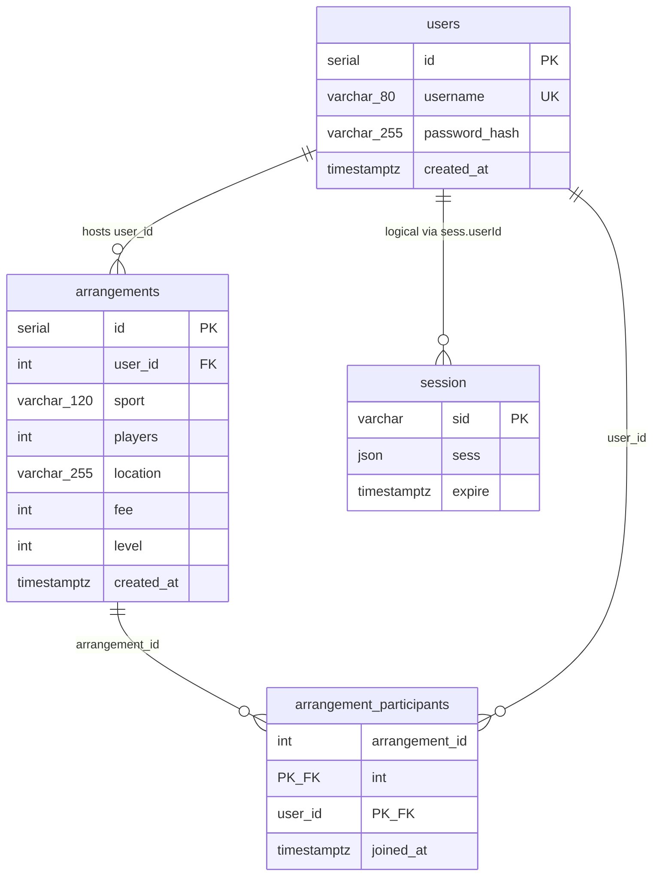

# Sportsbuddy — database documentation

This app uses **PostgreSQL** for persistent storage. The Node.js server (`server/`) connects with the **`pg`** driver. Sessions are stored in the database via [connect-pg-simple](https://github.com/voxpelli/node-connect-pg-simple), so logins survive server restarts (as long as the DB volume remains).

Schema is created on startup in `server/db.js` (`ensureSchema()`).

## Quick start (Docker)

**Production-style run (built image — `web` + `db`):**

```bash
cd sportsbuddy
docker compose up --build
```

Open [http://localhost:3000](http://localhost:3000) (login) or [http://localhost:3000/register.html](http://localhost:3000/register.html).

**Development (live reload — `web-dev` + `db`):**

```bash
docker compose --profile dev up --build db web-dev
```

Do not run **`web`** and **`web-dev`** at the same time on port **3000**. PostgreSQL data persists in the **`pgdata`** volume.

**Environment variables**

| Variable | Purpose |
|----------|---------|
| `DATABASE_URL` | PostgreSQL connection string |
| `SESSION_SECRET` | Secret for signing session cookies — **use a strong value in production** |
| `NODE_ENV` | `production` or `development` |
| `TRUST_PROXY` | Set to `1` behind an HTTPS reverse proxy (affects `secure` cookies in production) |
| `PORT` | HTTP port for the Node server (default **3000** in code) |

Example for production session secret:

```bash
SESSION_SECRET=$(openssl rand -hex 32) docker compose up --build
```

## Entity–relationship overview

- **`users`** — accounts (login).
- **`arrangements`** — one row per published session (host, sport, capacity, location, fee, level).
- **`arrangement_participants`** — who joined which arrangement; composite primary key `(arrangement_id, user_id)` so each user joins a given arrangement at most once.
- **`session`** — Express sessions (managed by `connect-pg-simple`). There is **no foreign key** from `session` to `users`; `sess` JSON holds `userId` / `username` after login.

On startup, the app **backfills** participants: every arrangement’s host (`arrangements.user_id`) gets a row in **`arrangement_participants`** if missing. If **`arrangements`** is empty, **demo data** is inserted: user **`nearby_demo`** and three sample arrangements (then participants are backfilled again).

### Visual ER diagram



### Table: `users`

| Column | Type | Constraints / notes |
|--------|------|---------------------|
| `id` | `SERIAL` | Primary key |
| `username` | `VARCHAR(80)` | Unique, `NOT NULL` |
| `password_hash` | `VARCHAR(255)` | `NOT NULL` — bcrypt |
| `created_at` | `TIMESTAMPTZ` | `NOT NULL`, default `NOW()` |

### Table: `arrangements`

| Column | Type | Constraints / notes |
|--------|------|---------------------|
| `id` | `SERIAL` | Primary key |
| `user_id` | `INTEGER` | `NOT NULL`, FK → `users(id)` `ON DELETE CASCADE` — **host / creator** |
| `sport` | `VARCHAR(120)` | `NOT NULL` |
| `players` | `INTEGER` | `NOT NULL`, `> 0` — max participants (capacity) |
| `location` | `VARCHAR(255)` | `NOT NULL` |
| `fee` | `INTEGER` | `NOT NULL`, `>= 0` — total fee in kr (UI splits by capacity) |
| `level` | `INTEGER` | `NOT NULL`, `1–10` — display level for the card |
| `created_at` | `TIMESTAMPTZ` | `NOT NULL`, default `NOW()` |

**Index:** `arrangements_created_at_idx` on `(created_at DESC)`.

### Table: `arrangement_participants`

| Column | Type | Constraints / notes |
|--------|------|---------------------|
| `arrangement_id` | `INTEGER` | FK → `arrangements(id)` `ON DELETE CASCADE` |
| `user_id` | `INTEGER` | FK → `users(id)` `ON DELETE CASCADE` |
| `joined_at` | `TIMESTAMPTZ` | `NOT NULL`, default `NOW()` |

**Primary key:** `(arrangement_id, user_id)`.

**Index:** `arrangement_participants_user_idx` on `(user_id)`.

### Table: `session`

Managed by `connect-pg-simple` with `createTableIfMissing: true`. Typical columns:

| Column | Type | Purpose |
|--------|------|---------|
| `sid` | `VARCHAR` | Session id |
| `sess` | `JSON` (or JSONB) | Session payload |
| `expire` | `TIMESTAMPTZ` | Expiry for cleanup |

Exact DDL follows the [connect-pg-simple](https://github.com/voxpelli/node-connect-pg-simple) version in `package.json`.

## HTTP API (JSON under `/api`)

All JSON routes expect `Content-Type: application/json` where a body is used. The browser uses `credentials: "same-origin"` so the session cookie is sent.

### Auth (`server/routes/auth.js`)

| Method / path | Description |
|---------------|-------------|
| `POST /api/register` | Body `{ username, password }` — creates user, starts session |
| `POST /api/login` | Body `{ username, password }` — starts session |
| `POST /api/logout` | Destroys session |
| `GET /api/me` | Current user JSON or `401` |

### Arrangements (`server/routes/arrangements.js`)

Requires session (same as `GET /api/me`).

| Method / path | Description |
|---------------|-------------|
| `GET /api/arrangements/my-stats` | `{ hostedCount, joinedCount }` |
| `GET /api/arrangements` | List arrangements with `participant_count`, `joined_by_me`, `creator_username`, … |
| `POST /api/arrangements` | Body `{ sport, players, location, fee }` — creates arrangement; host added as participant |
| `POST /api/arrangements/:id/join` | Join (409 if full or already joined) |
| `POST /api/arrangements/:id/leave` | Remove current user from participants |

### Admin (`server/routes/admin.js`)

Unauthenticated in code — **development only**; see [README.md](README.md).

| Method / path | Description |
|---------------|-------------|
| `GET /api/admin/meta` | Table names and row counts (whitelisted tables) |
| `GET /api/admin/table/:name` | Rows for `users`, `arrangements`, `arrangement_participants`, or `session` (max 500) |

Browser UI: **`GET /admin`** → `public/admin.html`.

## Security notes

- Passwords are hashed with **bcrypt** (cost factor 10 in `server/routes/auth.js`).
- Use a long random **`SESSION_SECRET`** in any shared or production environment.
- For HTTPS, terminate TLS at your reverse proxy and set **`TRUST_PROXY=1`** and **`NODE_ENV=production`** so cookies can be marked `secure` when configured in `server/index.js`.
- Restrict or remove **`/admin`** and **`/api/admin/*`** before exposing the app publicly.
