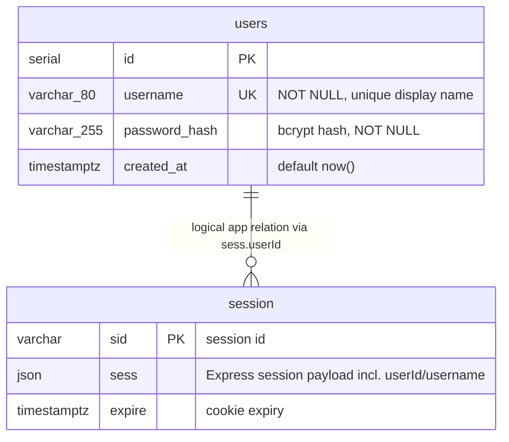

# Sportsbuddy — database documentation

This app uses **PostgreSQL** for persistent storage. The Node.js server (`server/`) connects with the `pg` driver. Sessions are stored in the database via [connect-pg-simple](https://github.com/voxpelli/node-connect-pg-simple), so logins survive server restarts (as long as the DB volume remains).

## Quick start (Docker)

**Production-style run (built image):**

```bash
cd sportsbuddy
docker compose up --build
```

Open [http://localhost:3000](http://localhost:3000) (login) or [http://localhost:3000/register.html](http://localhost:3000/register.html).

**Faster development loop (live code mount + nodemon):**

```bash
docker compose --profile dev up --build
```

Edit files on the host; the `web-dev` service reloads on change. PostgreSQL data stays in the `pgdata` volume.

**Environment variables**

| Variable         | Purpose                                      |
|-----------------|----------------------------------------------|
| `DATABASE_URL`  | PostgreSQL connection string                 |
| `SESSION_SECRET`| Secret for signing session cookies — **set a strong value in production** |
| `TRUST_PROXY`   | Set to `1` if the app sits behind HTTPS reverse proxy (affects secure cookies) |

Example for production session secret:

```bash
SESSION_SECRET=$(openssl rand -hex 32) docker compose up --build
```

## Entity–relationship overview

Application-owned data is the **`users`** table. **`session`** is created and used by `connect-pg-simple`; it stores serialized Express sessions (including `userId` / `username` after login). There is **no database-level foreign key** from `session` to `users` — integrity is enforced by application logic when resolving `/api/me`.

### Visual ER-diagram



### Table: `users`

| Column          | Type           | Constraints / notes                                      |
|-----------------|----------------|----------------------------------------------------------|
| `id`            | `SERIAL`       | Primary key                                              |
| `username`      | `VARCHAR(80)`  | Unique, `NOT NULL` — login name                          |
| `password_hash` | `VARCHAR(255)` | `NOT NULL` — output of `bcrypt`                        |
| `created_at`    | `TIMESTAMPTZ`  | `NOT NULL`, default `NOW()`                              |

**Indexes:** unique index on `username` (from `UNIQUE` constraint).

### Table: `session`

Managed by `connect-pg-simple` when `createTableIfMissing: true`. Typical columns:

| Column   | Type           | Purpose                                      |
|----------|----------------|----------------------------------------------|
| `sid`    | `VARCHAR`      | Session identifier                           |
| `sess`   | `JSON`         | Stored session object                        |
| `expire` | `TIMESTAMPTZ`  | Expiration; used to purge stale sessions     |

Exact DDL may match the version of `connect-pg-simple` in `package.json`; refer to the [project’s table SQL](https://github.com/voxpelli/node-connect-pg-simple) if you migrate by hand.

## API surface (auth)

| Method / path      | Description                                      |
|--------------------|--------------------------------------------------|
| `POST /api/register` | JSON `{ username, password }` — creates user, starts session |
| `POST /api/login`    | JSON `{ username, password }` — starts session   |
| `POST /api/logout`   | Destroys session                                 |
| `GET /api/me`        | Returns current user or `401`                    |

All JSON routes expect `Content-Type: application/json`. The browser client uses `credentials: "same-origin"` so the session cookie is sent on each request.

## Security notes

- Passwords are hashed with **bcrypt** (cost factor 10 in `server/routes/auth.js`).
- Use a long random `SESSION_SECRET` in any shared or production environment.
- For HTTPS deployments, terminate TLS at your reverse proxy and consider setting `TRUST_PROXY=1` and `NODE_ENV=production` so cookies can be marked `secure` appropriately.
